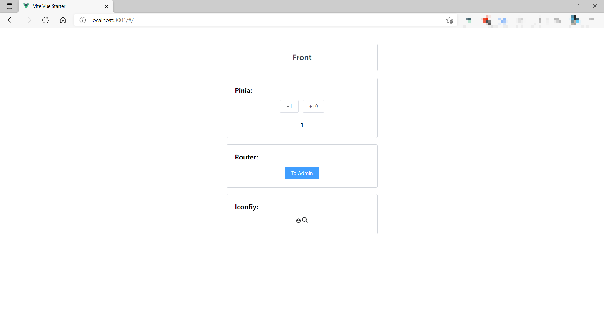
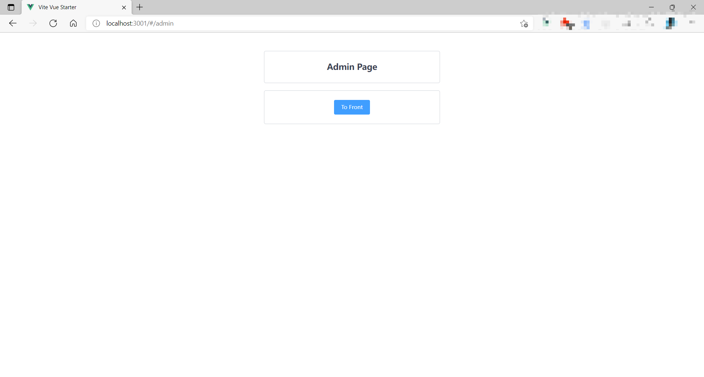

# vite+vue3 Starter Template

use:

- vite
- vue3
- ts
- element-plus
- tailwindcss
- pinia2 (vuex replacer)
- vue-router@latest

other:

- eslint
- prettier
- pnpm

---

Adaptation Webstorm 2021.2.3

# Icon

Use Iconify as svg icon source!

You can find many icons in:

- https://icones.js.org/collection/all
- https://icon-sets.iconify.design/

usage:

```javascript
<app-icon icon="ion:search" class="text-lg" />
```

the `ion:search` can find in two site above.

# For React

- https://github.com/Xwudao/react-starter-template

# Image




